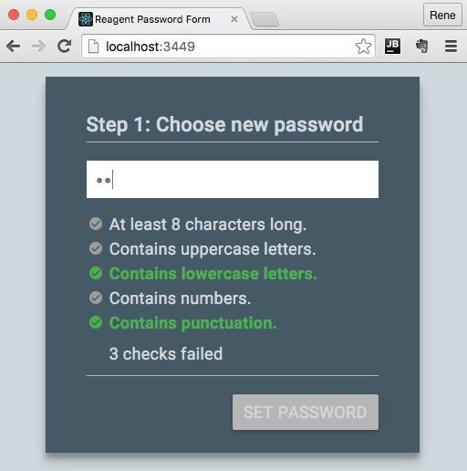

Reagent password field example
============================

A simple react example implementing a password field component, inspired by this blog post: http://nilshartmann.net/posts/folien-mit-react-komponenten-entwicklen-talk-auf-der-w-jax-2015
And this repository:
https://github.com/nilshartmann/react-example-app

Run
---
* clone the git repository
* lein figwheel
* In your webbrowser open http://localhost:3449
* Choose a password ;-)

Running example
---------------
* You can find a running example here: https://rpreissel.github.io/reagent-example-app/

Production build
----------------

To clean all compiled files:

    lein clean

To create a production build run:

    lein do clean, cljsbuild once min

And open your browser in `resources/public/index.html`. You will not
get live reloading, nor a REPL.
